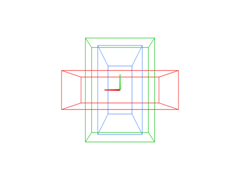

# burr-solver
This is a program for solving [6-piece Burr puzzles](https://en.wikipedia.org/wiki/Burr_puzzle).

### Getting Started

To get a feeling for how it works, run the following (ideally within a Python virtual environment):

    pip install -r requirements.txt
    python burr_solver.py

The output should be:

    Solving puzzle 0
    Shapes:
    xxxxxx/xx..xx/x....x/x....x
    xxxxxx/xxxxxx/x.x..x/x.x..x
    xxxxxx/xxxxxx/xxxxxx/xxxxxx
    xxxxxx/xxx.xx/x....x/x....x
    xxxxxx/xx..xx/x..xxx/x...xx
    xxxxxx/xx..xx/xxx..x/x....x

    Valid assembly A3a B1f E2f F4c D5d C6h found after checking 1 assemblies
    Disassembly takes 6 steps
    View solution: ./solution0.html

Some sample puzzles are provided in [puzzles.json](./puzzles.json). The pieces are described
using a simple text format: for each row of six voxels in the burr piece, an 'x' indicates that
it is occupied and a '.' indicates it is empty. You can run other puzzles by providing different
puzzle number:

    python burr_solver.py --puzzle 3

    Solving puzzle 3
    Shapes:
    xxxxxx/xxxxxx/xx..xx/xxx..x
    xxxxxx/xxx.xx/xx..xx/x.x..x
    xxxxxx/xx..xx/x....x/xx...x
    xxx.xx/xxxxxx/x.x..x/x....x
    xx..xx/xxxxxx/x....x/x.x..x
    xx.xxx/xxxxxx/x....x/x....x

    Puzzle is level 6 (Higher levels can result in longer solve times)
    Valid assembly A1a D2g C3h F4g B5b E6f found after checking 27 assemblies
    Disassembly takes 11 steps
    View solution: ./solution3.html

You can also provide your own by editing the JSON file. To manually indicate which
assembly you want to use:

    python burr_solver --puzzle --assembly 0

Assemblies are encoded using named places in the puzzle (A - F), numbered shapes (1-6), and
orientations (a-h).

The solution is encoded as a [scenepic](https://microsoft.github.io/scenepic/). You can see
a pre-rendered example from the solve for puzzle 1 below:

